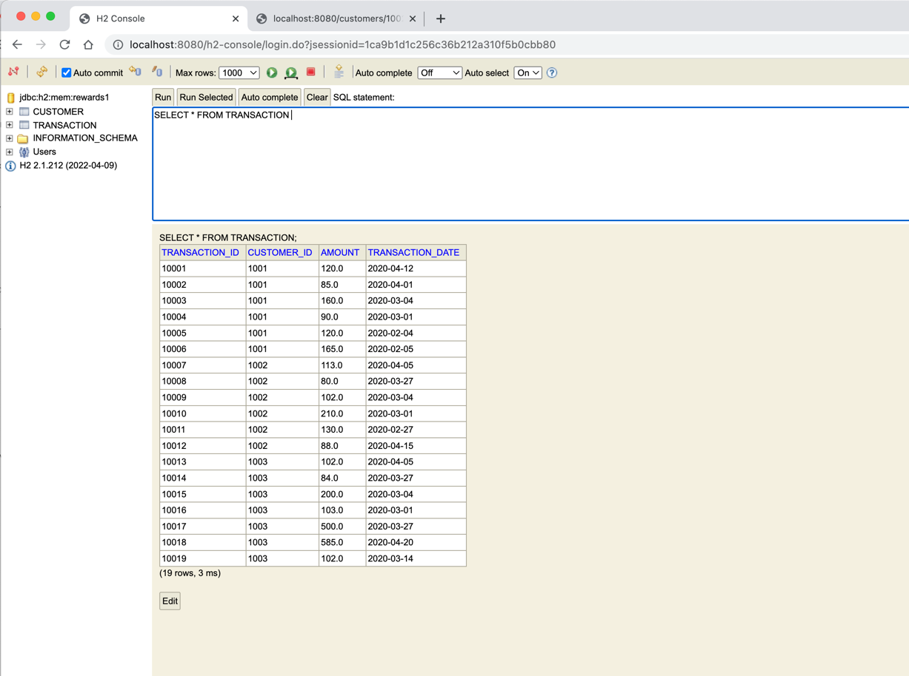
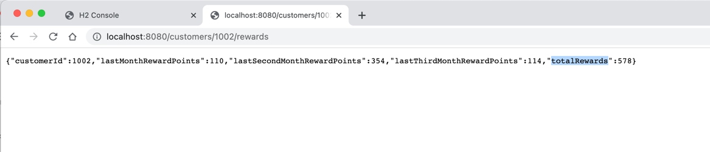

# Getting Started

### Reference Documentation

**Images of Dataset and Result outcome**

**Steps to use this Microservice**
1. Clone the project from Github using 'git clone URL'  
2. run maven command 'mvn spring-boot:run'
3. Hit the API end point '/customers/<customerId>/rewards'(Ex: http://localhost:8080/customers/1002/rewards)
4. Test the service using the below maven command
   ''
